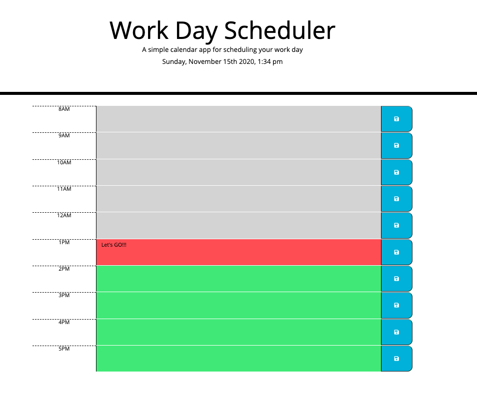

# Work Day Scheduler Starter Code
Work Day Scheduler Starter Code

# Linked

[Github](https://github.com/wdavonta/workday-scheduler.git) "Work Day Scheduler Repo"

[Link] ( https://wdavonta.github.io/workday-scheduler/)

# About the project
This project is about  using a daily planner to create a schedule. The current day is displayed at the top of the calendar. While scrolling presented with time blocks for standard business hours. Each time block is color-coded to indicate whether it is in the past, present, or future.
You be able to click on an event and click the save button for that time block. The text for that event is saved in local storage everytime the page is refresh the saved events persist.

# Contact Info
Da'Vonta Williamson

E: <a href="mailto:wdavonta@gmail.com">wdavonta@gmail.com</a>
                </address>

